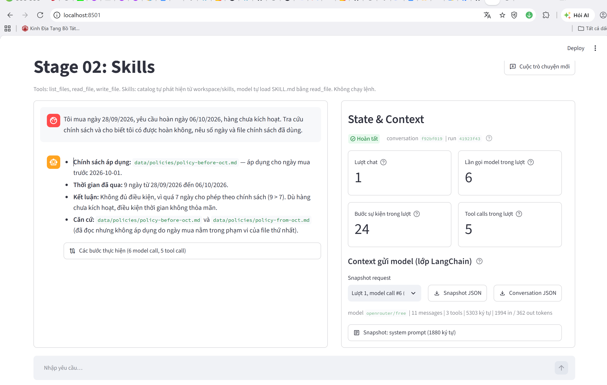
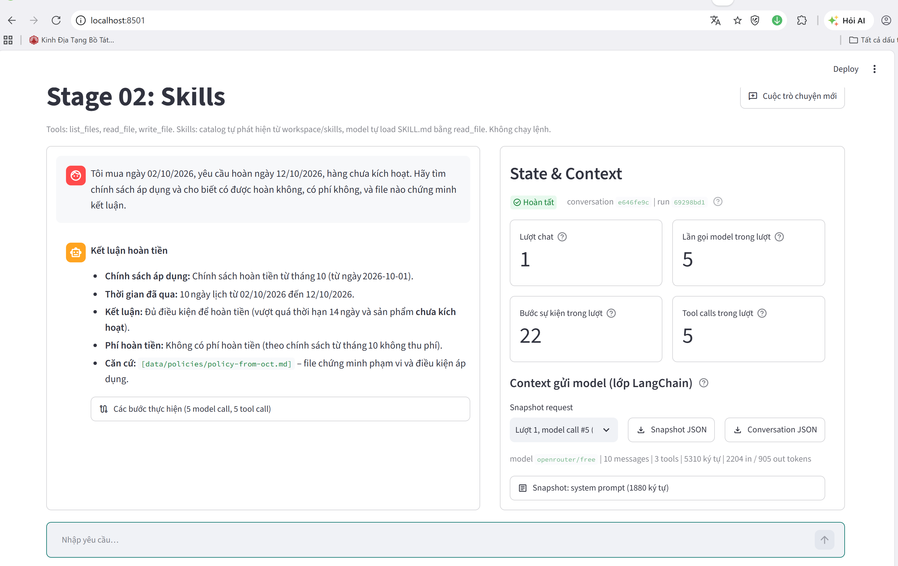
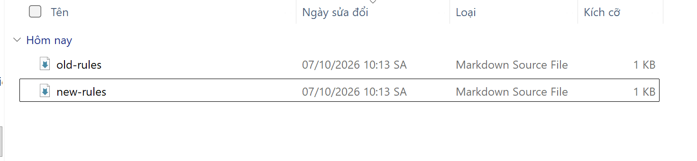
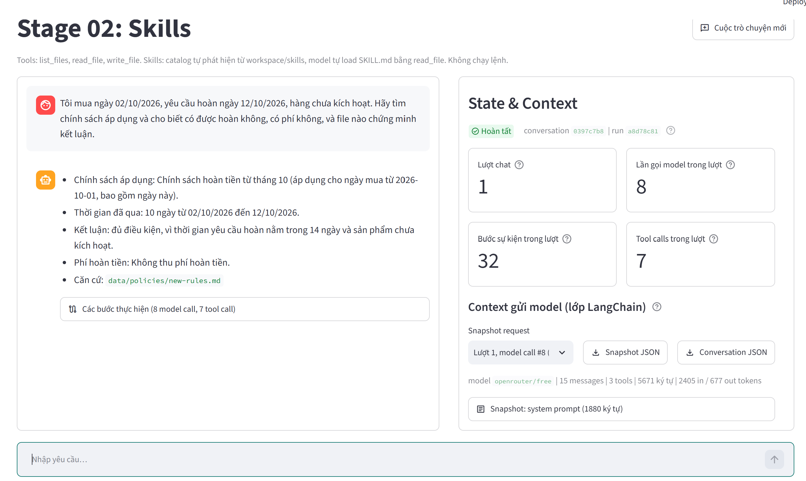
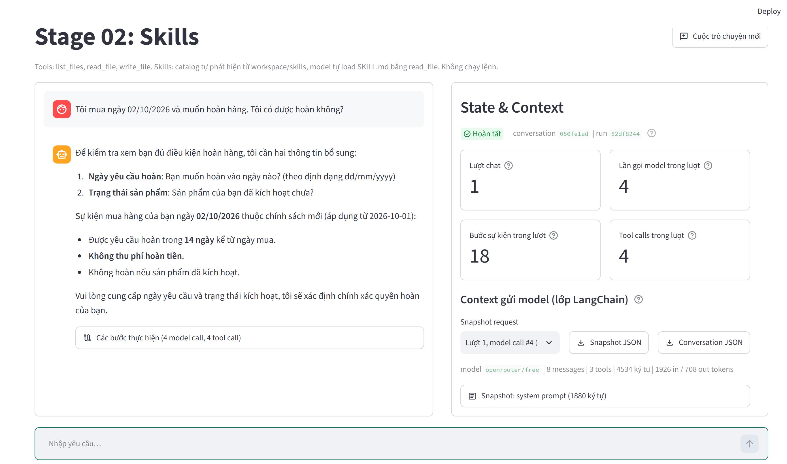

# Báo cáo Block 1 — Tra cứu chính sách bằng Tool và Skill

> **Người thực hiện:** [Điền họ tên]  
> **Ngày:** 07/10/2026  
> **Ứng dụng:** Stage 02: Skills, Streamlit tại `http://localhost:8501/`  
> **Model:** `openrouter/free`  
> **Ảnh minh họa:** Năm ảnh PNG được liên kết tương đối từ cùng thư mục với Markdown: `A.png`, `B.png`, `B-s.png`, `change.png` và `miss.png`.

## 1. Mục tiêu và yêu cầu

Bài tập yêu cầu xây dựng một agent có thể tìm tài liệu chính sách trong workspace và làm theo hướng dẫn nghiệp vụ trong skill. Các phần cần nộp gồm:

1. Mã nguồn tool mới và phần đăng ký tool ở Stage 01 và Stage 02.
2. Thư mục skill `refund-policy/` và hai tài liệu chính sách.
3. Trace cho trường hợp A, trường hợp B sau khi đổi tên file và trường hợp thiếu thông tin.
4. `analysis.md` nêu kiểm tra tool, kết quả từng tình huống và vị trí bằng chứng trong trace.
5. Trả lời câu hỏi: vì sao cần tool tìm file và skill chọn chính sách; liệu chỉ sửa prompt có đủ khi tên file thay đổi hay không.

Không đưa `.env` hoặc API key vào bài nộp.

## 2. Thiết kế giải pháp

### 2.1. Phân chia trách nhiệm

Giải pháp tách hai việc khác nhau:

- **Tool tìm/đọc file** cung cấp cho agent khả năng quan sát workspace thật. `list_files` trả về tên file hiện có; `read_file` lấy nội dung file. `write_file` chỉ ghi trong `workspace/output/`.
- **Skill `refund-policy`** hướng dẫn agent cách xử lý nghiệp vụ: xác minh dữ kiện, tìm tất cả chính sách, đọc toàn bộ tài liệu liên quan, so sánh ngày mua với phạm vi hiệu lực, tính số ngày và trả lời theo template.

Skill được phát hiện từ `workspace/skills/*/SKILL.md`. Catalog đưa metadata của skill vào system prompt; phần hướng dẫn đầy đủ không được nhúng sẵn vào prompt. Khi câu hỏi khớp skill, model dùng `read_file` đọc nội dung `SKILL.md`, rồi đọc tài liệu chính sách và template.

### 2.2. Cấu trúc code tool

Code tool được tách thành các module để mỗi phần có một nhiệm vụ rõ ràng:

| File | Vai trò |
|---|---|
| `tools/_common.py` | Chuẩn hóa đường dẫn tương đối và chặn đường dẫn tuyệt đối/traversal ra ngoài workspace. |
| `tools/listing.py` | Cài đặt `list_files`, chỉ liệt kê mục con trực tiếp và sắp theo tên. Symlink trỏ ra ngoài bị bỏ qua. |
| `tools/reading.py` | Cài đặt `read_file`, đọc UTF-8, giới hạn kích thước và báo lỗi có cấu trúc. |
| `tools/writing.py` | Cài đặt `write_file`, chỉ ghi bên trong `output/`, kiểm tra lại symlink và ghi UTF-8. |
| `tools/files.py` | Facade tương thích, gom API/tool helpers cho code cũ và test. |
| `tools/__init__.py` | Đăng ký/export `list_files`, `read_file`, `write_file` cho agent import. |
| `agent.py` | Tạo LangChain agent, khai báo tool, model và middleware theo giới hạn lượt gọi. |
| `skill_catalog.py` | Quét skill metadata, kiểm tra frontmatter và tạo danh sách skill trong system prompt. |

Cùng một cấu trúc tool được áp dụng tại `stage-01-files/` và `stage-02-skills/`. Stage 02 bổ sung catalog/loader skill.

### 2.3. Quy tắc trong skill

`fixtures/skills/refund-policy/SKILL.md` hướng dẫn agent:

1. Hỏi lại nếu thiếu ngày mua, ngày yêu cầu hoàn hoặc trạng thái kích hoạt.
2. Dùng `list_files` tìm chính sách hiện có, không đoán tên từ ví dụ/lịch sử.
3. Đọc tất cả file chính sách được liệt kê, kể cả file có thể không áp dụng.
4. Chọn chính sách theo **ngày mua** và phạm vi hiệu lực trong từng tài liệu.
5. Tính khoảng ngày theo dữ liệu khách cung cấp, không dùng ngày hiện tại.
6. Đọc `references/answer-template.md`; chỉ nêu phí khi khách đủ điều kiện và dẫn đúng file làm căn cứ.

### 2.4. Tài liệu chính sách mẫu

- `policy-before-oct.md`: áp dụng cho đơn mua trước 01/10/2026; yêu cầu trong 7 ngày; phí 10%; không hoàn nếu đã kích hoạt.
- `policy-from-oct.md`: áp dụng từ 01/10/2026; yêu cầu trong 14 ngày; miễn phí; không hoàn nếu đã kích hoạt.

Do đó tên file không phải quy tắc lựa chọn. Ngày mua và nội dung phạm vi hiệu lực mới quyết định tài liệu nào áp dụng.

## 3. Cách chạy và cách kiểm tra trên web

1. Cấu hình OpenRouter trong `.env` cục bộ và chạy Stage 02 bằng Streamlit. Không đưa `.env` vào gói nộp.
2. Mở `http://localhost:8501/`, xác nhận tiêu đề **Stage 02: Skills** và các tool `list_files`, `read_file`, `write_file`.
3. Mỗi tình huống bắt đầu bằng **Cuộc trò chuyện mới** để lịch sử câu trước không ảnh hưởng kết quả.
4. Gửi câu hỏi thử nghiệm tương ứng ở mục 4.
5. Mở **Các bước thực hiện**, **Event log** và phần **State & Context** để kiểm tra tool call, kết quả tool và skill đã được đọc.
6. Đợi agent trả lời xong; lượt lỗi xác thực hoặc không có tool call không được xem là test đạt.
7. Trace JSONL được ghi trong `stage-02-skills/traces/`. Ghi lại tên trace tương ứng từng lượt.

## 4. Các tình huống và kết quả

### 4.1. Trường hợp A — Chính sách trước tháng 10

**Câu hỏi đã chạy:**

> Tôi mua ngày 28/09/2026, yêu cầu hoàn ngày 06/10/2026, chưa kích hoạt. Tra cứu chính sách và cho biết tôi có được hoàn không, nêu số ngày và file chính sách đã dùng.

**Luồng kiểm tra mong đợi:** đọc skill → liệt kê `data/policies` → đọc hai file chính sách → đọc answer template → kết luận.

**Bằng chứng trong lượt A mới chạy:**

- Trace: `stage-02-skills/traces/20261007-135912_f92bf019_turn01_41923f43.jsonl`
- Trace ghi prompt người dùng, việc đọc `skills/refund-policy/SKILL.md`, liệt kê thư mục chính sách, đọc cả `policy-before-oct.md` và `policy-from-oct.md`, đọc `answer-template.md`, và kết thúc bằng `run_completed`.
- Mốc tham chiếu trace: các record `tool_started`/`tool_finished` theo đúng thứ tự trên. Trace JSONL không lưu nguyên văn câu trả lời cuối.

**Kết quả đối chiếu chính sách:** ngày mua 28/09 thuộc chính sách trước tháng 10. Khoảng từ 28/09 đến 06/10 là 8 ngày; giới hạn là 7 ngày nên không đủ điều kiện thời gian. Vì khách không đủ điều kiện, template yêu cầu không nêu dòng phí.

**Ảnh A — lượt A, mua 28/09 và yêu cầu hoàn 06/10:**



**Lưu ý về phép đếm ngày:** ảnh A hiển thị 9 ngày theo cách đếm gộp cả ngày mua và ngày yêu cầu. Khoảng thời gian đã trôi qua giữa hai mốc là 8 ngày (06/10 trừ 28/09). Cả 8 và 9 đều vượt giới hạn 7 ngày nên kết luận không đủ điều kiện không thay đổi; phần phân tích trong báo cáo dùng 8 ngày đã trôi qua.

### 4.2. Trường hợp B — Chính sách từ tháng 10, trước khi đổi tên

**Câu hỏi đã chạy:**

> Tôi mua ngày 02/10/2026, yêu cầu hoàn ngày 12/10/2026, hàng chưa kích hoạt. Hãy tìm chính sách áp dụng và cho biết có được hoàn không, có phí không, và file nào chứng minh kết luận.

**Bằng chứng lượt B mới chạy:**

- Trace: `stage-02-skills/traces/20261007-141254_e646fe9c_turn01_69298bd1.jsonl`
- Agent đọc skill, liệt kê `policy-before-oct.md` và `policy-from-oct.md`, đọc cả hai file cùng `answer-template.md`, rồi ghi nhận `run_completed`.

**Kết quả đối chiếu chính sách:** ngày mua 02/10 thuộc chính sách có hiệu lực từ 01/10. Khoảng thời gian là 10 ngày, nằm trong giới hạn 14 ngày; sản phẩm chưa kích hoạt nên đủ điều kiện và không mất phí. File áp dụng là `data/policies/policy-from-oct.md`.

Lượt này kiểm tra chính sách B với tên file ban đầu; yêu cầu B **sau khi đổi tên** được kiểm tra riêng ở mục tiếp theo.

**Ảnh B — lượt B dùng tên file gốc, trước khi đổi tên:**



### 4.3. Trường hợp B sau khi đổi tên file

**Thao tác trước khi chạy:** đổi tên trong `workspace/data/policies/`:

```text
policy-before-oct.md  →  old-rules.md
policy-from-oct.md    →  new-rules.md
```

**Câu hỏi:** dùng cùng dữ kiện B: mua ngày 02/10/2026, yêu cầu hoàn 12/10/2026, chưa kích hoạt.

**Trace chạy sau khi đổi tên: `stage-02-skills/traces/20261007-145739_0397c7b8_turn01_a8d78c81.jsonl`. Trace trước đó cùng tình huống cũng có tại `stage-02-skills/traces/20261007-103848_9b2a0b0f_turn01_8a37236d.jsonl`.

Trace của lượt mới ghi nhận `list_files` trả về `new-rules.md` và `old-rules.md`; agent đọc cả `data/policies/new-rules.md`, `data/policies/old-rules.md` và answer template, rồi kết thúc lượt. Kết luận: 10 ngày, đủ điều kiện, miễn phí; căn cứ là `data/policies/new-rules.md`.

Đây là bằng chứng trực tiếp rằng agent phát hiện tên file đang có trong workspace thay vì dựa vào tên cũ đã ghi trong prompt.

**Ảnh change — thư mục chính sách sau khi đổi tên:**



**Ảnh B-s — lượt B sau khi sửa/đổi tên, dẫn căn cứ `new-rules.md`:**



### 4.4. Trường hợp A sau khi đổi tên — kiểm tra bổ sung

Trace bổ sung: `stage-02-skills/traces/20261007-103808_40b66db9_turn01_cb6a373c.jsonl`.

Trace cho thấy agent liệt kê hai tên mới, đọc cả hai chính sách và template. Với ngày mua trước 01/10, file nội dung chính sách cũ (đã đổi tên thành `old-rules.md`) vẫn là căn cứ; 8 ngày vượt quá 7 ngày nên không đủ điều kiện. Trước lần chạy đạt này có một lượt sai ban đầu được lưu tại `20261007-103642_50b595e2_turn01_6855382d.jsonl`; model đã đọc file có tên mới nhưng chưa đọc đủ cả hai chính sách. Skill được làm rõ yêu cầu đọc toàn bộ file và lần chạy lại đạt đúng. Trace lỗi được giữ để minh bạch quá trình sửa.

### 4.5. Thiếu trạng thái kích hoạt

**Câu hỏi trong ảnh miss:**

> Tôi mua ngày 02/10/2026 và muốn hoàn hàng. Tôi có được hoàn không?

**Trace của lượt miss:** `stage-02-skills/traces/20261007-150310_050fe1ad_turn01_82df8244.jsonl`. Trace ghi agent đã đọc skill, liệt kê và đọc hai file chính sách, rồi kết thúc lượt; ảnh cho thấy agent hỏi bổ sung ngày yêu cầu hoàn và trạng thái kích hoạt.

**Ảnh miss — trường hợp thiếu ngày yêu cầu và trạng thái kích hoạt:**



## 5. Kiểm tra tool và test code

### 5.1. Kiểm tra trực tiếp bản code đã tách module

Đã chạy kiểm tra trực tiếp code mới ở cả Stage 01 và Stage 02. Các mục đã kiểm tra:

| Kiểm tra | Kết quả |
|---|---|
| Liệt kê file trong thư mục chính sách và sắp theo tên | Đạt |
| Đường dẫn trỏ tới file thay vì thư mục | Trả `NOT_A_DIRECTORY` |
| Thư mục không tồn tại | Trả `DIRECTORY_NOT_FOUND` |
| Đường dẫn traversal ra ngoài workspace | Trả `PATH_OUTSIDE_WORKSPACE` |
| Đọc đường dẫn ngoài workspace | Bị chặn |
| Ghi ra ngoài `output/` | Bị chặn |
| Ghi file UTF-8 trong `output/` | Đạt; đọc lại được nội dung tiếng Việt |

Cả hai stage đều qua kiểm tra trực tiếp này.

### 5.2. Test tự động đã có trong dự án

`tests/test_files.py` kiểm tra đọc, liệt kê, lỗi đường dẫn, symlink escape, file quá lớn, UTF-8 và giới hạn ghi trong output. `tests/test_agent.py` kiểm tra tool registration, luồng gọi tool và skill đọc các chính sách đã đổi tên.

`analysis.md` trong dự án ghi nhận kết quả lần chạy pytest trước đó là Stage 01: 36/36 và Stage 02: 44/44. Các con số đó có trước lần refactor tách module gần đây; báo cáo này **không khẳng định đã chạy lại toàn bộ pytest sau refactor**. Kiểm tra trực tiếp sau refactor ở mục 5.1 đã chạy riêng và qua ở cả hai stage.

### 5.3. Tính toàn vẹn trace

Các trace A, B thường, B sau đổi tên và thiếu thông tin đều ghi `run_completed`, tool names/paths và kết quả tool. Trace được app lưu không chứa nguyên văn câu trả lời cuối; vì vậy ảnh chụp vùng chat là bằng chứng phù hợp để bổ sung câu trả lời cuối vào báo cáo.

Một lượt thử khác từng nhận lỗi xác thực `401 User not found` và có 0 tool call. Lượt lỗi đó không được dùng làm kết quả đạt. Các trace dẫn trong các mục trên là những lượt có chuỗi tool call hoàn tất.

## 6. Câu hỏi cuối bài

Agent cần **tool tìm file** vì tên và tập file thật sự có trong workspace có thể thay đổi. `list_files` cung cấp danh sách hiện tại; `read_file` cho agent nội dung để xác minh phạm vi hiệu lực. Agent cần **skill** vì việc tìm thấy file chưa đủ để biết phải chọn chính sách nào, cách xử lý điều kiện kích hoạt, cách tính số ngày và cách trình bày câu trả lời. Skill chứa quy trình nghiệp vụ có thể tái sử dụng và được tải khi phù hợp.

Nếu agent không có tool tìm file, chỉ sửa prompt **không giải quyết đáng tin cậy yêu cầu đổi tên file**. Prompt có thể hướng dẫn agent đoán hoặc thử một số tên, nhưng agent không thể quan sát danh sách file thực tế; tên mới chưa biết trước sẽ khiến nó bỏ sót tài liệu hoặc dựa vào tên cũ. Tool cung cấp khả năng khám phá; skill chỉ dẫn cách dùng thông tin đã khám phá để chọn và áp dụng chính sách.

## 7. Bản đồ ảnh minh chứng

| Ảnh | Vị trí trong báo cáo | Nội dung |
|---|---|---|
| `A.png` | Trường hợp A | Kết quả với ngày mua 28/09 và chính sách trước tháng 10. |
| `B.png` | Trường hợp B trước khi đổi tên | Kết quả B trỏ tới `policy-from-oct.md`. |
| `change.png` | B sau khi đổi tên | File Explorer hiển thị `old-rules.md` và `new-rules.md`. |
| `B-s.png` | B sau khi sửa/đổi tên | Kết quả trỏ tới `data/policies/new-rules.md`. |
| `miss.png` | Thiếu thông tin | Agent hỏi ngày yêu cầu hoàn và trạng thái kích hoạt. |

Các ảnh nằm cạnh file Markdown; đường dẫn ảnh là tương đối để GitHub hiển thị khi cả năm PNG được commit cùng report.

## 8. Kết luận

Giải pháp kết hợp ba tool thao tác file với skill hướng dẫn nghiệp vụ. Tool giúp agent tìm đúng các tài liệu đang tồn tại và đọc nội dung; skill giúp chọn tài liệu theo ngày mua, áp dụng điều kiện và hỏi lại khi thiếu dữ kiện. Các trace cho thấy luồng khám phá và đọc file hoạt động với cả tên ban đầu lẫn tên đã đổi. Bằng chứng cuối cùng nên kèm ảnh chụp câu trả lời trong web do trace JSONL không lưu nguyên văn phần trả lời cuối.