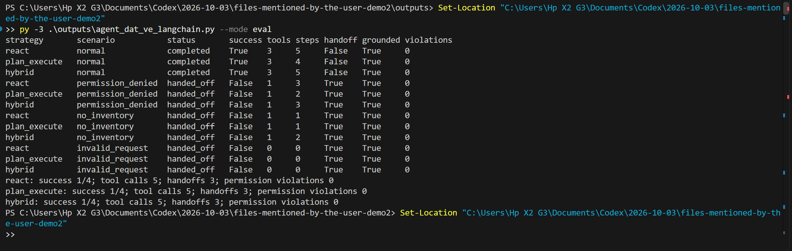
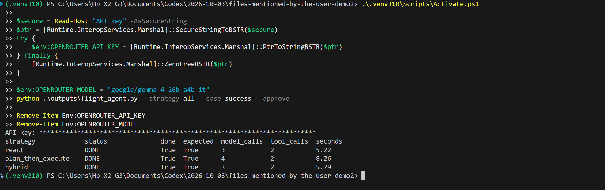

# ĐẠI HỌC QUỐC GIA THÀNH PHỐ HỒ CHÍ MINH
# TRƯỜNG ĐẠI HỌC CÔNG NGHỆ THÔNG TIN

<br>

## BÁO CÁO BÀI THỰC HÀNH SỐ 3
## DỰNG AGENT ĐẶT VÉ MÁY BAY BẰNG LANGCHAIN

**Sinh viên:** Trần Ngọc Hân  
**Mã số sinh viên:** 23520437  
**Lớp:** SE373.R11  
**Giảng viên thực hành:** ThS. Nguyễn Hiếu Nghĩa

---

## Tóm tắt

Bài tập xây dựng agent đặt vé máy bay trên inventory giả lập, tập trung vào bốn lớp harness: (1) ràng buộc yêu cầu được lưu thành dữ liệu, (2) kiểm quyền trước hành động, (3) xác nhận hoàn tất bằng cách đọc booking từ sổ dữ liệu, và (4) bàn giao cho người khi agent không hoàn thành. Phần chạy tương tác dùng `create_agent` của LangChain, tool khai báo bằng `@tool`, giới hạn gọi model và OpenRouter qua `ChatOpenAI`. Ba chiến lược ReAct, Plan-then-Execute và Lai được cung cấp. Benchmark offline chạy cùng bốn tình huống không cần API key; phần online chạy bằng model thật để so sánh lượt gọi model, tool và thời gian.

## Mục lục

1. [Đề bài và phạm vi](#1-đề-bài-và-phạm-vi)
2. [Tìm hiểu LangChain, LangGraph và yêu cầu thiết kế](#2-tìm-hiểu-langchain-langgraph-và-yêu-cầu-thiết-kế)
3. [Thiết kế hệ thống](#3-thiết-kế-hệ-thống)
4. [Bốn thành phần harness](#4-bốn-thành-phần-harness)
5. [Ba chiến lược agent](#5-ba-chiến-lược-agent)
6. [Thiết kế đánh giá](#6-thiết-kế-đánh-giá)
7. [Kết quả đánh giá](#7-kết-quả-đánh-giá)
8. [Hướng dẫn cài đặt và chạy](#8-hướng-dẫn-cài-đặt-và-chạy)
9. [Hạn chế và hướng phát triển](#9-hạn-chế-và-hướng-phát-triển)
10. [Kết luận](#10-kết-luận)

## 1. Đề bài và phạm vi

Đề yêu cầu tìm hiểu LangChain/LangGraph, tạo tool mô phỏng, viết harness cho agent, triển khai ba mẫu ReAct, Plan-then-Execute và Lai, sau đó đánh giá hiệu quả của từng mẫu. Sản phẩm gồm mã Python và báo cáo.

Chương trình không kết nối hãng hàng không, không giữ chỗ và không thu tiền thật. Inventory cùng booking ledger nằm trong bộ nhớ. `flight_agent.py` minh họa cách dùng LangChain với model thật; cần cấu hình nhà cung cấp và API key. `agent_dat_ve_langchain.py` là benchmark tất định, chạy offline để minh họa luồng và so sánh theo cùng dữ liệu.

## 2. Tìm hiểu LangChain, LangGraph và yêu cầu thiết kế

### 2.1 LangChain

LangChain là framework cung cấp các thành phần cấp cao để xây dựng ứng dụng dùng mô hình ngôn ngữ, gồm tích hợp model, prompt và tool. Với agent, `create_agent` nhận model, danh sách tool và system prompt; model có thể yêu cầu gọi tool, nhận kết quả tool rồi tiếp tục xử lý cho đến khi tạo câu trả lời cuối. Hàm `@tool` giúp khai báo hàm Python để agent sử dụng.

Trong bài này, `flight_agent.py` dùng `create_agent` để kết nối model với hai tool mock `search_flights` và `book_flight`. `ModelCallLimitMiddleware` giới hạn số lượt gọi model. OpenRouter là nơi cung cấp model, còn `ChatOpenAI` là adapter tương thích API để nối model với LangChain.

### 2.2 LangGraph

LangGraph là framework/runtime điều phối agent và quy trình nhiều bước. Khái niệm chính của Graph API là **state** (dữ liệu trạng thái), **node** (bước xử lý) và **edge** (hướng chuyển giữa các bước). Nhờ vậy có thể kết hợp bước Python xác định với bước model suy luận, tạo vòng lặp, lưu trạng thái hoặc dừng để chờ con người duyệt.

Trong triển khai này, `create_agent` của LangChain chạy trên runtime LangGraph để điều phối vòng model → tool → observation. Phần code không tự khai báo `StateGraph`; các kiểm tra nghiệp vụ được viết tường minh trong `Harness` để dễ đọc và kiểm tra. Cách phân chia này dùng API agent cấp cao của LangChain, đồng thời dựa vào runtime LangGraph ở bên dưới.

### 2.3 Yêu cầu thiết kế áp dụng cho bài toán

Hệ thống tách phần model đề xuất hành động khỏi các quyết định nghiệp vụ cần kiểm soát bằng code:

1. Lưu yêu cầu đặt vé thành đối tượng `Constraints`, có thể kiểm tra và chuyển thành nội dung đầu vào cho model.
2. Model đề xuất hành động qua tool; harness Python kiểm tra quyền và điều kiện trước khi tool đặt vé thực hiện.
3. Xác minh hoàn tất bằng cách đọc booking trong dữ liệu, không dựa riêng vào câu trả lời cuối của model.
4. Nếu không thể hoàn thành, tạo thông tin bàn giao có lý do, trạng thái và câu hỏi tiếp theo cho người dùng.
5. Giới hạn số lượt gọi model để tránh vòng lặp không dừng và kiểm soát thời gian chạy.

Các khái niệm được đối chiếu với tài liệu chính thức: [LangChain Agents](https://docs.langchain.com/oss/python/langchain/agents) và [LangGraph Overview](https://docs.langchain.com/oss/python/langgraph/overview).

## 3. Thiết kế hệ thống

### 3.1 Kiến trúc tổng quát

```text
Yêu cầu người dùng
       │
       ▼
Constraints (dữ liệu) ── validate / prompt
       │
       ▼
LangChain create_agent ── model + tools + system prompt + model-call limit
       │ đề xuất tool
       ▼
Harness Python ── kiểm ràng buộc + kiểm quyền trước đặt vé
       │
       ├── bị chặn / không có chuyến ──► handoff()
       │
       ▼
Mock inventory / booking ledger
       │
       ▼
is_done() đọc booking ──► DONE hoặc FAILED + HANDOFF
```

LangChain điều phối vòng model → tool → observation trong `create_agent`. Agent chạy trên runtime đồ thị của LangGraph; ở mức bài tập, logic quyền và hoàn tất vẫn nằm trong hàm Python dễ kiểm tra.

### 3.2 Dữ liệu và mock tool

`flight_agent.py` khai báo lớp `Constraints` với sân bay đi/đến, ngày bay, giờ cất cánh muộn nhất, ngân sách tối đa mỗi vé, số hành khách và trạng thái đồng ý mua. Ví dụ mặc định: SGN → DAD ngày 07/10/2026, cất cánh trước 12:00, tối đa 2.000.000 VND/vé, một hành khách.

Inventory có ba chuyến giả:

| Mã | Giờ | Giá/vé | Ghế còn | Kết quả với ràng buộc mặc định |
|---|---:|---:|---:|---|
| VN142 | 08:15 | 1.650.000 VND | 4 | Hợp lệ |
| VJ628 | 13:20 | 1.250.000 VND | 3 | Không hợp lệ: khởi hành sau giờ giới hạn |
| VN125 | 09:40 | 2.450.000 VND | 2 | Không hợp lệ: vượt ngân sách |

`search_flights` trả về những chuyến thỏa mọi ràng buộc; `book_flight` chỉ tạo một booking giả. Các tool được tạo theo từng phiên để dùng đúng constraints và ledger của phiên đó.

### 3.3 Các trạng thái kết thúc

- **DONE:** booking tồn tại, trạng thái `CONFIRMED`, đúng tuyến/ngày/số hành khách và chuyến thỏa constraints.
- **FAILED + HANDOFF:** không tìm thấy booking đã xác minh, yêu cầu không khả thi, thiếu quyền hoặc agent chỉ trả lời mà không tạo booking.
- **Model-call limit:** giới hạn số lượt gọi model để vòng agent có trần chi phí. Giới hạn này không thay thế kiểm tra hoàn tất.

## 4. Bốn thành phần harness

### 4.1 Ràng buộc là dữ liệu — `Constraints`

Các yêu cầu không chỉ nằm trong prompt. Chúng được lưu thành thuộc tính Python và có hàm `is_ok(flight)` để kiểm lại bằng code. `to_prompt()` truyền cùng dữ liệu cho model. Nhờ đó prompt giúp model hiểu nhiệm vụ, còn Python là nơi quyết định chuyến có hợp lệ không.

Điều kiện chuyến hợp lệ: đúng sân bay đi/đến; đúng ngày; giờ khởi hành trước giới hạn; giá mỗi vé không vượt ngân sách; và số ghế đủ cho nhóm.

### 4.2 Kiểm quyền trước tool — `Harness.check_permission()`

Tool đặt vé gọi `check_permission()` trước khi ghi booking. Harness từ chối nếu chuyến vi phạm bất kỳ constraint nào hoặc người dùng chưa xác nhận mua. Model không có quyền tự đặt trường đồng ý thành đúng: cờ `purchase_approved` chỉ được đặt bởi đối số `--approve` do người chạy truyền vào.

Đây là kiểm soát trong luồng tool thật: nếu model gọi `book_flight` mà không có xác nhận, tool trả `BLOCKED` và booking ledger không đổi.

### 4.3 Hoàn tất kiểm bằng code — `Harness.is_done()`

Không dùng câu trả lời cuối của model làm bằng chứng đặt vé. `is_done()` đọc booking ledger và xác minh trạng thái, tuyến, ngày, số hành khách và tính hợp lệ của chuyến. Chỉ khi hàm này trả `True`, chương trình mới xuất trạng thái `DONE`.

### 4.4 Bàn giao — `Harness.handoff()`

Khi không có booking xác minh được, chương trình trả gói bàn giao gồm:

- trạng thái `FAILED + HANDOFF` và lý do;
- constraints ban đầu;
- lịch sử tool đã thử;
- booking hiện có (nếu có);
- câu hỏi gợi ý để người dùng sửa yêu cầu hoặc chuyển nhân viên.

Điều này tránh việc agent thất bại im lặng hoặc tuyên bố đặt vé dù chưa có booking.

### 4.5 Giới hạn số lượt gọi model

`ModelCallLimitMiddleware` đặt giới hạn tối đa 10 lượt gọi model cho mỗi phiên để tránh agent gọi model quá nhiều hoặc lặp vô hạn. Với Plan-then-Execute, một lượt dành cho bước lập kế hoạch nên agent thực thi còn tối đa 9 lượt. Giới hạn lượt gọi giúp kiểm soát thời gian và chi phí sử dụng model; `is_done()` kiểm tra booking đã hoàn tất đúng hay chưa.

## 5. Ba chiến lược agent

| Chiến lược | Luồng điều khiển | Ưu điểm | Hạn chế |
|---|---|---|---|
| ReAct | Model quyết định → tool → observation → model quyết định tiếp | Dễ điều chỉnh theo kết quả vừa nhận; hợp tác vụ cần khám phá | Có thể tốn nhiều lượt model; cần giới hạn lượt và chống lặp |
| Plan-then-Execute | Model lập kế hoạch trước; executor nhận kế hoạch rồi dùng tool | Tách suy nghĩ kế hoạch khỏi thi hành; dễ xem lại kế hoạch | Kế hoạch có thể lỗi thời sau observation; cần kiểm lại từng hành động |
| Lai | Lập kế hoạch mức cao, thực thi bằng vòng ReAct và điều chỉnh theo observation | Giữ định hướng nhưng vẫn phản ứng được với kết quả tool | Thường thêm một lượt lập kế hoạch; cần trace rõ |

Trong `flight_agent.py`, chọn bằng `--strategy`. ReAct để `create_agent` điều phối trực tiếp. Plan-then-Execute gọi model tạo kế hoạch không có tool, sau đó đưa kế hoạch và yêu cầu vào agent có tool. Mẫu Lai hướng agent lập kế hoạch ngắn rồi điều chỉnh từng bước theo observation. Tất cả cùng dùng một toolset và cùng harness.

## 6. Thiết kế đánh giá

Benchmark offline trong `agent_dat_ve_langchain.py` chạy 3 chiến lược trên cùng bốn ca. Model giả/luồng xác định được dùng thay LLM để kết quả không phụ thuộc nhà cung cấp hoặc API key.

| Ca | Điều kiện | Hành vi đúng |
|---|---|---|
| `normal` | Có chuyến trong ngân sách và đã đồng ý mua | Chọn giá thấp nhất, tạo booking, xác minh |
| `permission_denied` | Có chuyến nhưng chưa đồng ý mua | Không gọi tool đặt vé; bàn giao xin xác nhận |
| `no_inventory` | Không có chuyến khớp tuyến | Không bịa chuyến; bàn giao gợi ý sửa constraints |
| `invalid_request` | Mã sân bay/ngày/số khách sai | Chặn trước tool call; yêu cầu nhập lại |

Chỉ số: booking được xác minh; số tool calls; số decision steps của controller; số bàn giao; căn cứ dữ liệu; vi phạm quyền. `decision steps` là bộ đếm quy ước của benchmark offline, không phải số token hoặc lượt gọi LLM thật.

## 7. Kết quả đánh giá

### 7.1 Benchmark offline

Lệnh `python agent_dat_ve_langchain.py --mode eval` chạy 12 phiên (3 chiến lược × 4 ca). Kết quả đã chạy:

| Chiến lược | Booking xác minh | Bàn giao đúng | Tool calls tổng | Decision steps tổng | Vi phạm quyền |
|---|---:|---:|---:|---:|---:|
| ReAct | 1/1 ca đủ điều kiện; 1/4 tổng | 3/3 ca cần bàn giao | 5 | 9 | 0 |
| Plan-then-Execute | 1/1 ca đủ điều kiện; 1/4 tổng | 3/3 ca cần bàn giao | 5 | 7 | 0 |
| Lai | 1/1 ca đủ điều kiện; 1/4 tổng | 3/3 ca cần bàn giao | 5 | 10 | 0 |

Trong ca thường, ba chiến lược đều tạo booking xác minh cho chuyến rẻ nhất hợp lệ. Khi thiếu quyền, không chiến lược nào gọi đặt vé. Khi không có chuyến hoặc constraints sai, agent bàn giao thay vì tuyên bố thành công. Cả ba có cùng số tool calls vì chung một quy trình nghiệp vụ; số decision steps khác nhau do cách controller mô phỏng mức lập kế hoạch và phản hồi.

**Diễn giải:** Plan-then-Execute dùng ít decision steps nhất trong benchmark nhỏ này. Không thể kết luận nó luôn hiệu quả hơn: đây là model giả với quy tắc cố định, không đo chất lượng lập kế hoạch, độ trễ, chi phí token hay tỷ lệ lỗi của LLM thật. `flight_agent.py --strategy all --approve` so sánh trực tiếp ba mẫu với cùng model và ca thành công; bỏ `--approve` để so sánh ca thiếu quyền; chọn `--case no_inventory` để so ca không có chuyến. Phần online ghi lượt model, tool và thời gian. Kết quả phụ thuộc model và có thể tiêu thụ quota; bảng offline vẫn là kết quả lặp lại chính xác.


Dán ảnh terminal kết quả `--mode eval` tại đây.

### 7.2 So sánh online bằng OpenRouter

Lệnh `python .\outputs\flight_agent.py --strategy all --case success --approve` được chạy trong môi trường ảo `.venv310`, với model `google/gemma-4-26b-a4b-it`. Cờ `--approve` xác nhận quyền thực hiện thao tác đặt vé mock. Cả ba chiến lược dùng cùng yêu cầu, inventory, tool và harness.

 
Dán ảnh terminal có đủ ba chiến lược, trạng thái, số lượt model/tool và thời gian tại đây. Đảm bảo API key chỉ hiện dưới dạng dấu `*`.

Cả ba lượt chạy đều có `done=True` và `expected=True`, nghĩa là chương trình kiểm chứng được booking hợp lệ cho ca thành công. Mỗi chiến lược gọi tool hai lần: tìm chuyến và đặt chuyến. Plan-then-Execute dùng thêm một lượt model để lập kế hoạch, vì vậy tổng số lượt model là bốn; ReAct và Hybrid có ba lượt. Trong lần đo này ReAct nhanh nhất (5,22 giây), kế đến Hybrid (5,79 giây), rồi Plan-then-Execute (8,26 giây).

Đây là một lần chạy cho mỗi chiến lược, không phải benchmark thống kê. Độ trễ mạng, tải nhà cung cấp và biến thiên đầu ra model có thể làm thời gian hoặc số lượt thay đổi. Kết luận phù hợp với dữ liệu là cả ba đều hoàn thành ca thành công trong lần đo; ReAct nhanh nhất và dùng ít lượt model hơn Plan-then-Execute trong lần chạy này. Muốn so sánh chắc hơn cần chạy lặp nhiều lần cho mỗi ca, rồi báo cáo trung vị thời gian, token/chi phí và tỷ lệ thành công.

## 8. Hướng dẫn cài đặt và chạy

### 8.1 Cài môi trường Python 3.10

```powershell
# Chỉ tạo môi trường lần đầu nếu chưa có .venv310:
py -3.10 -m venv .venv310

# Kích hoạt và cài thư viện vào đúng môi trường:
.\.venv310\Scripts\Activate.ps1
python -m pip install -r .\outputs\requirements.txt
python --version
```

Mã mặc định dùng `google/gemma-4-26b-a4b-it`; cần chọn model có hỗ trợ tool calling. Nếu muốn đổi, đặt `OPENROUTER_MODEL` thành slug model khác có hỗ trợ tool calling. Khi `Read-Host -AsSecureString` hỏi, dán toàn bộ key; mỗi ký tự được che bằng dấu `*`, nên cần thấy nhiều dấu sao.

Nhập key khi chạy trong PowerShell để không lưu key trong mã nguồn:

```powershell
$secure = Read-Host "OpenRouter API key" -AsSecureString
$ptr = [Runtime.InteropServices.Marshal]::SecureStringToBSTR($secure)
try {
  $env:OPENROUTER_API_KEY = [Runtime.InteropServices.Marshal]::PtrToStringBSTR($ptr)
  $env:OPENROUTER_MODEL = "google/gemma-4-26b-a4b-it"
  python .\outputs\flight_agent.py --strategy all --case success --approve
} finally {
  [Runtime.InteropServices.Marshal]::ZeroFreeBSTR($ptr)
  Remove-Item Env:OPENROUTER_API_KEY -ErrorAction SilentlyContinue
  Remove-Item Env:OPENROUTER_MODEL -ErrorAction SilentlyContinue
}
```

### 8.2 Chạy tương tác với mock tool

```powershell
python .\outputs\flight_agent.py --strategy react --approve
python .\outputs\flight_agent.py --strategy plan_then_execute --approve
python .\outputs\flight_agent.py --strategy hybrid --approve
```

`--approve` thể hiện người dùng đã cho phép mua trong phiên mock. Không truyền cờ này để quan sát harness chặn giao dịch và yêu cầu xác nhận. Chạy tình huống không có inventory bằng `--case no_inventory`.

Sau khi kích hoạt `.venv310` và cài thư viện, so sánh ba chiến lược trên cùng ca bằng model OpenRouter. Lệnh gọi model riêng cho mỗi chiến lược:

```powershell
python .\outputs\flight_agent.py --strategy all --case success --approve
python .\outputs\flight_agent.py --strategy all --case permission_denied
python .\outputs\flight_agent.py --strategy all --case no_inventory
```

Mỗi so sánh gọi model riêng cho từng chiến lược. Chọn model có hỗ trợ tool calling và dùng đúng slug `provider/model` trong danh mục OpenRouter. Không ghi API key vào mã nguồn hoặc báo cáo.

### 8.3 Chạy đánh giá tất định

```powershell
python .\outputs\agent_dat_ve_langchain.py --mode eval
python .\outputs\agent_dat_ve_langchain.py --mode demo --strategy hybrid --scenario normal
```

Benchmark offline không cần API key. Mã tương tác LangChain cần provider model và khóa hợp lệ.

## 9. Hạn chế và hướng phát triển

1. Dữ liệu chuyến, giá, số ghế và booking đều là mock; không thể dùng để mua vé thật.
2. Chạy `flight_agent.py` cần model/provider và API key; kết quả LLM có thể thay đổi giữa các lần chạy.
3. Benchmark offline kiểm tra controller/harness, không đo độ chính xác của LLM.
4. Consent hiện là cờ CLI. Ứng dụng thật phải gắn xác nhận với danh tính/phiên và log thời điểm, nội dung xác nhận.
5. Booking mock chưa có giao dịch nguyên tử, chống đặt trùng, hủy vé, hoàn tiền hoặc xử lý lỗi từ hãng.
6. Phiên bản nâng cấp nên dùng inventory từ API, kiểm giá/tồn chỗ ngay trước khi đặt, thêm booking idempotency, kiểm dữ liệu cá nhân, trace LangSmith/LangGraph và benchmark nhiều ca có lỗi/timeout.

## 10. Kết luận

Bài tập minh họa agent không được tự xem câu trả lời của mình là kết quả nghiệp vụ. Constraints được giữ thành dữ liệu, tool đặt vé kiểm quyền trước khi chạy, hoàn tất được xác minh bằng cách đọc booking, và thất bại tạo gói bàn giao. LangChain cung cấp vòng điều phối tool; harness Python giữ các quyết định an toàn quan trọng. Cả ba chiến lược đều hoàn tất ca thành công trong lần đánh giá online đã ghi; ReAct nhanh nhất trong lần đo, còn Plan-then-Execute dùng thêm một lượt model để lập kế hoạch. Kết quả offline bổ sung các ca từ chối quyền, không có chuyến và đầu vào sai; giới hạn của một lần đo online được nêu rõ.

